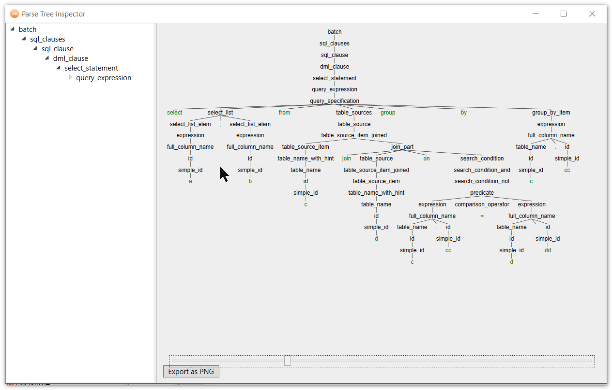
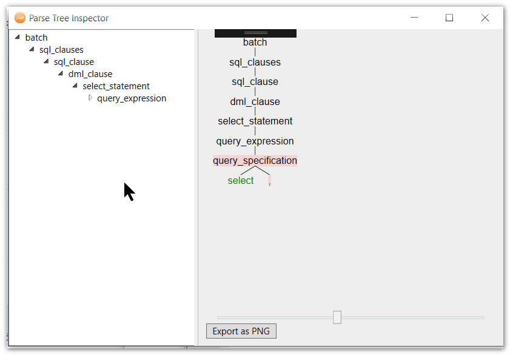
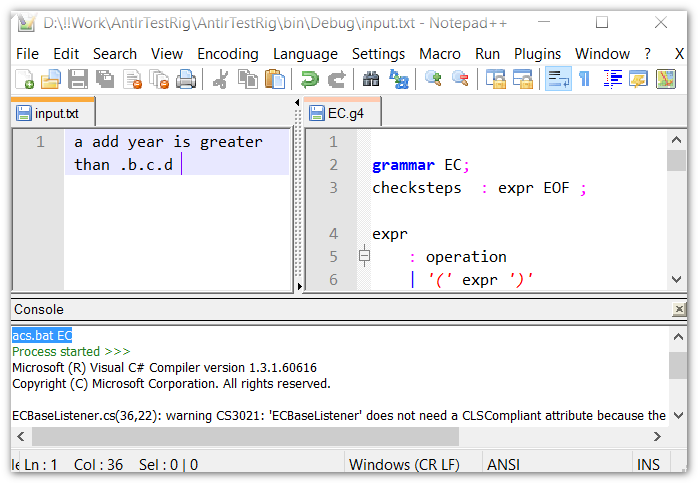

This project aimed to mimic the official ANTLR4 TestRig which looks like this:


## Features 

* All features that official TestRig provides: zoom, save as PNG, tree view, error highlight





* It also enhanced some parts that official TestRig does not have:

  * Auto expand to 5 levels in treeview
  * Use different color for terminal nodes
  * Watch input file change and reload
  * Watch dll file change and reload
  * Show rule index and token type (with -ruleindex option)


## TODO:

* The way UI shows problem token is kind of different than official one.
* Post script(-ps option) not supported


## Quick start

* First make sure you setup your machine the official way, following [the article on ANTLR github](https://github.com/antlr/antlr4/blob/master/doc/getting-started.md) , that means you have java runtime installed, antlr jar file in the class path,  **antlr4** shortcut ready, etc..
* Build the solution.
* Run `demoGrammar\step1_generateCsFromG4.bat` , this should generate *.cs files from the grammar file, given you have setup it correctly
* Run `demoGrammar\step2_compileDll.bat`, this should yield `demo.dll` from the cs files
* Run `demoGrammar\step3_openTestRig.bat`, this should start up the UI on the demo language
  
* Now try to modify input.txt and save, see how it changes the UI


## My recommended setup


Note you are encouraged to create shortcut to make less typing, I have one like this in **acs.bat** (stands for ANTLR+csharp) in the %PATH%

```
@call antlr4 -Dlanguage=CSharp %1.g4
@if %errorlevel% neq 0 exit /b %errorlevel%

@call csc /target:library /out:%1.dll  /reference:Antlr4.Runtime.Standard.dll %1*.cs
@if %errorlevel% neq 0 exit /b %errorlevel%
```

So I can call `acs tsql ` to generate C# and compile with 1 command


Since the TestRig can watch input and dll changes and reload without restart, it is convenient to work side by side with an editor with some shortcuts. I use Notepad++'s NppExec plugin to setup Ctrl+D to call `acs.bat $(NAME_PART)` (as I the setup above) 



The highlight for g4 comes from [https://github.com/B1naryStudio/antlr-npp](https://github.com/B1naryStudio/antlr-npp)