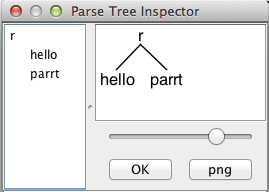

This project aimed to mimic the official ANTLR4 TestRig which looks like this:




The motivation of this project is that there are some g4 files contains C# code injection, so it can't be compiled with javac and debuged with official TestRig.


## Features 

* All features that official TestRig provides: zoom, save as PNG, tree view, error highlight


* It also enhanced some parts that official TestRig does not have:

  * Auto expand to 5 levels in treeview
  * Use different color for terminal nodes
  * Watch input file change
  * Show rule index and token type (with -showtype option)


## TODO:

* The way UI shows problem token is kind of different than official one.
* Post script(-ps option) not supported


## Usage

* First make sure you setup your machine the official way, following [the article on ANTLR github](https://github.com/antlr/antlr4/blob/master/doc/getting-started.md) , that means you have java runtime installed, antlr jar file in the class path,  **antlr4** shortcut ready, etc..
* Copy the grammar file under the execution folder of this project, for example, `tsql.g4` from [here](https://github.com/antlr/grammars-v4/blob/master/tsql/tsql.g4)
* `antlr4 -Dlanguage=CSharp tsql.g4` If this goes well, you will see some parser and lexer cs files generated, like `tsqlParser.cs`
* Compile the cs:
  `csc /target:library /out:tsql.dll  /reference:Antlr4.Runtime.Standard.dll tsql*.cs`
  If this step goes well, you should see `tsql.dll` compiled by `csc`
* Call this program: `AntlrTestRig.exe tsql tsql_file input.sql -gui -tokens  `
  This will scan all dll files under the same folder to find tsqlParser to parse your input file from the start rule you specified, in this case, tsql_file rule.


> Note you are encouraged to create shortcut to make less typing, I have one like this in **acs.bat** (stands for ANTLR c#) in the %PATH%
>
> ```
> antlr4 -Dlanguage=CSharp %1.g4
>
> csc /target:library /out:%1.dll  /reference:Antlr4.Runtime.Standard.dll %1*.cs
>
> AntlrTestRig.exe %* -gui -tokens
> ```
>
> So I can call `acs  tsql tsql_file input.sql` to do all from code generation to UI launching.


## Problems you may get

* If you see compile issues from the generated code, it is usually because either of the 2 reasons:
  * The antlr4 you setup has different version than the one the runtime dll is (v4.6 now), ANTLR's API may change, keep the version the same. 
  * The g4 file may contains none C# code injection. In this case, just use the official TestRig